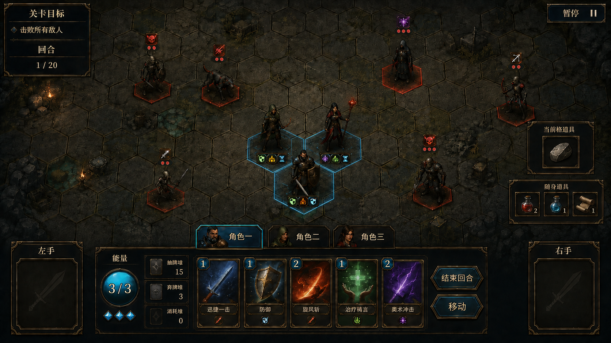

# 六边形战场交互

## 一、界面信息层级

战斗界面由战场、单位与地格信息、卡牌与行动区、关卡目标、敌方意图、装备和临时道具区组成。现有手牌、能量、牌堆、状态和战斗日志继续保留。能量、牌堆与当前角色行动信息集中在手牌附近，不堆叠在屏幕最下沿。

战场是主要交互区域；玩家应当能在不打开额外窗口的情况下识别当前位置、可移动格、攻击距离、卡牌影响范围、敌方意图、战场物件和关卡目标进度。

## 二、战场浏览

- 仅支持右键按住拖动平移战场。
- 战场显示比例固定，不支持鼠标滚轮缩放，也不提供其他缩放入口。
- 提供返回玩家小队或战场中心的快捷操作。
- 屏幕边缘存在关卡目标相关单位或敌方威胁时，可显示方向提示。

第一版仅支持键鼠。右键拖动在普通状态、移动预览和目标选择期间始终用于平移地图；左键不参与地图拖动，可选择角色及确认行动。卡牌、道具、装备允许左键拖动，“仅点击”限制只针对地图平移。右键平移必须同步作用于地格、单位、攻击表现和正在播放移动动画的单位，不能让缓存的动画坐标停留在拖动前屏幕位置。固定显示比例避免为多档缩放同步制作和校验全部单位、地格、状态与特效资源。战场不提供旋转操作。

## 三、格点交互标记

不同交互阶段使用不同格点标记。这些标记不是格点类型；除障碍格外均为普通格，其上的单位、陷阱、机关、道具与地形状态独立表现。机关不再作为独立格点类型。

| 状态 | 表现目的 |
|------|----------|
| 当前单位所在格 | 标明选中单位的位置 |
| 可移动格 | 表明本次行动允许到达 |
| 移动路径 | 显示从当前位置到目标格的路径 |
| 默认/武器攻击距离 | 默认邻接单目标；按当前武器和卡牌显示实际选取边界 |
| 卡牌影响范围 | 显示卡牌最终可能影响的格点和单位 |
| 合法目标 | 明确可以确认的敌方单位或目标格 |
| 非法目标 | 保留可见但弱化，并提供不可选原因 |

当前位置、可移动范围与攻击范围不能只依赖相近颜色区分，应同时使用边框、纹理或图标。

## 四、单位选择与移动

### 4.1 选择单位

- 点击玩家单位后，将其设为当前操作单位。
- 同步切换该角色的手牌、能量、状态、装备和临时道具信息。
- 选中单位时显示当前位置和默认/当前武器攻击距离；没有武器仍显示可攻击的相邻格。
- 点击其他玩家单位可以直接切换，不要求先取消当前选择。
- 手牌上方固定显示三个角色 Tab；点击 Tab 会选中对应角色，并把镜头平滑移动到该角色。
- 点击战场上的玩家单位与点击角色 Tab 使用同一套切人逻辑。
- 普通浏览状态下，左键点击只对玩家角色生效。
- 敌人、爪牙、保护目标和其他非玩家单位不能通过点击进入“选中”状态；鼠标悬停时显示其详细信息，移开后关闭。
- 进入卡牌、道具或技能的目标选择流程后，左键点击合法的非玩家单位表示确认行动目标，不代表选中或切换该单位。
- 角色地图小人下方常驻显示状态缩略图标；悬停角色或状态图标时显示状态名称、层数、效果和衰减时机。

### 4.2 移动预览

- 点击手牌右侧“移动”按钮进入移动预览；取消后回到当前角色普通操作状态。
- “结束回合”位于“移动”上方。两按钮等宽等高，在独立行动区内上下均匀分布，不侵占右手装备槽。
- 进入移动状态后不默认高亮任何格。鼠标未按下时，仅悬停预览一次移动动作可达的路径，经过格与连线显示为绿色。
- 按住左键后，已经过的合法相邻格按顺序追加进路线，不会被后续鼠标位置自动重算；只能从路线末端反向回到前一节点时逐格撤销。无法追加的悬停格不产生表现，也不改动既有路线。
- 松开鼠标且路线非空后，原“移动”按钮替换为并排等高的“确定移动 / 取消移动”；确定后按既有路线匀速逐格移动，取消、Esc 或规划中的“取消移动”均清除路线且不扣资源。
- 不可到达格保持不可确认，并显示阻挡、距离不足或资源不足等原因。
- 确认移动后播放逐格或连续移动表现；坐标更新和途中触发顺序由玩法规则确定。
- 基础移动动作距离为 1 格，基础情况下每次动作消耗 1 能量并计一次移动；按钮附近显示单次移动距离、总能量消耗和剩余次数。后续移动距离增益提高单次动作可经过的格数，费用与次数按移动动作计算。装备修改额度后立即刷新，已用次数保留；剩余为 0 或能量不足时禁用移动提交。
- 目标不可前往时显示具体原因，保留原位置且不扣能量/次数。普通移动期间不插入敌人行动；已知陷阱、机关与坠落风险应在预览提示。

## 五、卡牌范围与目标选择

目标选择维护两个可操作状态：当前行动角色和当前待结算行动。非玩家单位只有临时悬停信息，不保存为独立的选中单位。所有卡牌和道具都先确定行动来源，再按照目标类型选择单位或格点。

### 5.1 打出攻击牌

1. 玩家拖出攻击牌进入行动预览。
2. 战场显示该牌的合法选取范围。
3. 指向单位或格点时，显示卡牌影响范围预览。
4. 范围内将实际受影响的单位高亮；敌我颜色和图标应明确区分。
5. 非法目标不允许确认，并显示“超出攻击距离”“不在影响范围内”等具体原因。
6. 确认后才扣除费用并进入现有 Effect、伤害与状态结算。

### 5.2 完整目标选择逻辑

1. 点击角色或角色 Tab，确定当前行动角色；镜头是否自动回中取决于入口：点 Tab 回中，直接点地图角色不额外移动镜头。
2. 点击卡牌后进入行动预览；检查是否有可用武器，没有武器或持双防具仍允许默认相邻单目标攻击，结合卡牌范围，不提示“必须装备武器”。
3. 左键点击手位可将其武器或防具设为当前预选装备，后续卡牌默认使用该装备；再次左键点击同一手位取消预选，左键点击另一手位则切换预选。右键点击手位只打开装备详情，不改变预选状态。两手都未预选且本次卡牌需要在两件装备之间选择时，才要求确认使用的装备；只有一件可用武器时自动选中，双手武器自动占用本次攻击来源。
4. 根据角色位置、所选武器攻击距离和卡牌模板生成候选，不使用武器自身范围形状。没有武器用默认距离 1，再按卡牌规则处理。
5. 单位目标卡高亮合法单位；格点目标卡高亮合法格点；范围卡在鼠标悬停时预览最终覆盖区域。
6. 点击敌方单位时：只有正在选目标且该单位合法时才确认目标；普通状态下点击不产生效果，详细信息仅由悬停显示。
7. 点击友方时：若卡牌允许以其为目标，则确认目标；否则切换到该角色。保护目标等非玩家友方仅在合法目标流程中接受点击，普通状态下只响应悬停。
8. 单次点击确认还是“选中后再次确认”由危险程度区分：普通单体行动可松开鼠标确认；会命中友军、触发陷阱或改变多个单位位置的行动要求再次确认。
9. 确认时再次校验单位位置、射程、费用和目标存活状态；校验失败则保留卡牌并刷新范围。
10. `Esc` 逐级取消：先取消目标，再取消武器选择，最后把卡牌退回手牌。右键拖动只平移地图，不触发取消。

### 5.3 范围预览

- 单体攻击突出目标单位所在格。
- 范围攻击同时标出中心格、范围边界和实际命中单位。
- 每种攻击配置声明其输入为中心格或中心方向。玩家点击一个格点：中心格型攻击将该格作为中心格；中心方向型攻击从该格解析方向并预览范围。格点不属于任何合法中心方向时，保持非法提示；具体的提示与改选交互后续统一设计，不自动改为最近方向。
- 范围覆盖空格时仍显示范围形状，避免玩家只能通过单位高亮猜测效果区域。
- 卡牌含多段不同范围效果时，应区分各段范围或按实际执行顺序预览。
- 突进/远程预览显示路径与首个拦截格；没有穿透时不能把被挡住的原目标画成确定命中。穿透时显示攻击可继续通过的路径。
- 爆炸预览以实际命中目标为中心；显示邻近受影响单位，半径和敌我过滤按最终定义，不自行默认无友伤。
- 突进预览显示连锁击退箭头；可推动单位显示连锁与半伤提示，免疫单位/障碍显示回弹箭头和原被击退者惩罚。回弹影响原攻击者的位置与不承受碰撞惩罚分别显示。

### 5.4 取消操作

- 取消键或把卡牌拖回手牌区可以取消目标选择；右键拖图不取消行动。
- 取消前不扣费用、不移动卡牌、不改变状态。
- 若卡牌已进入多步选牌或多目标流程，界面应显示当前步骤和剩余选择数量。

## 六、敌方意图

- 意图来源为 `DataBase/Battlefield/EnemyIntent.csv`，按怪物 ID 与意图序号配置攻击方式、射程、移动预算、行动预算、索敌策略、范围半径、预览确定性和固定预览方向。
- 数值不确定时，怪物头顶显示移动图标与攻击图标；悬停 Tooltip 说明行动总额及“移动/攻击将在敌方回合分配”。
- 数值确定、范围待索敌时，头顶显示攻击图标与“伤害×次数”；Tooltip 说明攻击方式、移动预算和索敌策略，不承诺具体目标或范围。
- 数值和范围确定时，头顶同样显示攻击图标与“伤害×次数”；悬停该怪物会在战场显示红色半透明范围和边框。离开悬停即清除，不常驻遮挡战场。
- 敌方回合按怪物队列逐格移动、逐条 Effect 结算；每个移动或攻击表现完成后才推进下一节拍。当前运行时采用“移动后攻击”流程；`AttackThenMove` 字段仅作为后续扩展配置，尚未改变结算顺序。

## 七、装备交互

- 角色信息区显示两个并列装备槽位。
- 左右手位仅替换旧武器槽；头盔、护甲、鞋、饰品仍保留在角色装备信息中，不能因战斗底栏仅显示双手而移除。
- 单手武器或防具占用一个槽位。
- 双手武器或防具以横跨两个槽位的形式显示，明确表示已占满。
- 拖入双手装备时，如果任一槽位已有装备，应先提示将被替换的装备，不能静默覆盖。
- 单手装备放入已被双手装备占用的槽位时，也应先提示替换关系。
- 装备详情显示类型、单手/双手、攻击距离及其他属性或效果。
- 战斗中允许更换装备；进入敌方结算动画、暂停或其他阻塞流程时不接受装备操作。
- 换装不消耗能量或移动次数；换下的一件或两件装备加入角色所在格物品堆，已有道具装备不触发移位。有陷阱/机关时才寻找最近可接收格，并显示预计落点。

装备栏确定为手牌区左右两侧：左侧是左手位，右侧是右手位。两个装备槽宽高完全相同，顶边、底边、标题位置、卡面比例和视觉权重对称。右侧三个随身道具栏整排上移，其上方居中设置一个“当前格道具”槽；四个道具槽独立布局，不能挤压或改变右手装备槽尺寸。双手装备使用一张横跨两侧语义的卡面，或在两槽显示同一装备的主卡与锁定副槽。

- 左键点击手位预选或取消预选装备；右键点击手位查看装备详情。
- 当前格为装备时，从“当前格道具”入口拖到对应手位完成拾取/换装；默认不能拖入三个随身道具槽，保留未来装备能力允许武器存入道具栏的扩展入口。
- 攻击需要武器时，可用手位发光；已预选手位持续显示选中标记，未预选时才在出牌流程中确认本次使用的武器。
- 左右手轮流使用产生增益时，在两个手位之间显示“上次使用手”标记和下一手增益提示。
- 右手装备栏上方固定显示当前角色的三个临时道具栏位。
- 切换角色后，左右手装备与三个道具栏同步切换为该角色的数据。
- 当前角色能量显示在手牌左上方或手牌头部区域，牌堆按钮排列在其附近；状态不集中放在底栏，而是在角色地图小人下方显示缩略图。

## 八、战场物件交互

### 8.1 临时道具

- 未拾取道具直接显示在对应格点。
- 指向道具时显示名称、效果和拾取条件。
- 到达格点后，当前格道具槽显示该格道具，不自动进入随身栏。
- 当前格槽不随身携带。离开后槽内显示消失，原格道具仍在；再次返回时，未被使用、拾取或销毁的道具重新显示。
- 从当前格槽拖出道具可以直接进入使用流程，也可以拖入空闲随身槽完成拾取；只有完成拾取后才从原格移除并随角色携带。
- 当前格槽无道具时显示空槽；切换角色时按新角色当前位置刷新，不沿用上一角色格点内容。
- 三个随身槽保持不变。当前格道具区按稳定顺序依次展示同格物品；玩家直接从当前展示项拖动使用、拾取或装备，移走后显示下一项。无需另开分页列表或新增常驻槽位。
- 地面武器/防具与道具共用当前格展示位置；道具可放入空随身槽，装备必须装到手位。角色可与这些物件处于同格。
- 丢弃、扔出及换装丢弃可加入已有物品堆，只有触发物件或非法地面阻止接收时才提示其他落点。随机预览与提交在位置仍合法时保持一致。
- 玩家按当前格道具区的展示顺序逐件使用或拾取，以实例 ID 标识所操作的物品；移走后更新显示，其他物品原地保留。切人、离格或关闭当前格道具区后，未提交拖动取消，不移动堆内物品。
- 道具只归拾取角色持有，不在小队间共享。
- 使用道具时按其目标类型进入单位或格点选择。
- 战斗结束界面明确提示未使用的临时道具已清除。

### 8.2 陷阱与机关

- 已发现的陷阱或机关在格点上显示图标和效果提示。
- 悬停提示标明“一次性”或“每次进入触发”；永久物件离开后再次进入仍触发。随机物件的外观生成暂只记录需求，不在本期实施。
- 未发现陷阱是否完全隐藏或显示可疑标记，待探索规则确定。
- 指向移动目的格时，应在确认前提示已知的到达触发效果。
- 触发后显示来源格、受影响单位、正负面效果和是否仍可再次触发。
- 一次性机关/陷阱触发后销毁并清除物件位；永久物件保留，离开再进入继续触发。击退、拉拽、传送同样触发，传送按实际落点处理。
- 投放陷阱时显示自身一圈及装备/增益修正后的合法范围；有单位或任意物件的格不可投放，不能自动转投附近格。机关只在开局生成，不提供局内投放按钮。
- 陷阱、机关各自最多一个且不能同格；两者都不能与道具装备堆同格。提示具体阻挡原因；一次性触发销毁后才可在原格放下物品。

## 九、关卡目标界面

### 9.1 通用目标栏

- 战斗顶部固定显示本关目标类型和当前进度。
- 多个条件必须同时满足时逐项展示，不合并成一句模糊描述。
- 胜负判定发生变化时即时刷新。

### 9.2 各目标类型

| 关卡类型 | 必要信息 |
|----------|----------|
| 歼灭 | 剩余在场必杀敌人数；离场另计并影响奖励；爪牙单独标记 |
| 生存 | 当前回合 / 目标回合，第 N 回合结束后全额胜利；下一波生成提示；提前胜利要求无存活敌人（含爪牙）且无待生成增援 |
| 保护目标 | 保护单位名称、生命、位置、必须击败敌人数 |
| 敌人离场影响奖励 | 已击败价值点数、总价值点数、当前奖励档位 |

爪牙单位在单位标识和目标栏中使用一致图标，避免玩家误以为必须清除。

## 十、结算交互

- 达成当前关卡目标时进入胜利结算，不再统一依赖“场上没有怪物”。
- 保护目标死亡时显示本关失败原因、无通关奖励提示和即将施加的弱化；不显示整局游戏结束。
- 有敌人离场时，结算界面列出击败、离场和仍存活敌人的价值点数。
- 卡牌奖励减少时，明确显示触发原因和计算比例。
- 正常奖励按每个角色一张展示；需要减少奖励时随机取消不同角色的卡牌奖励。
- 仍存活的爪牙在目标达成后如何退场或清理，应有明确表现，不能继续阻塞结算界面。

## 十一、输入状态优先级

为避免卡牌拖动、地图拖动和单位选择相互冲突，输入状态按以下优先级处理：

1. 暂停或结算界面打开时，阻止战场输入。
2. 多步选牌、目标选择或范围方向选择进行中时，只处理当前流程允许的输入。
3. 单位移动预览进行中时，拖动战场不应误判为确认移动。
4. 无行动流程时，左键点击玩家角色用于切换；其他单位只响应悬停详情；右键拖动任意战场位置用于平移。
5. 任何流程取消后恢复到当前角色的普通操作状态。

## 十二、待决策项

1. 各人物移动额度与装备修正值的显示；移动动作基础距离为一格，基础情况下每次动作消耗 1 能量并计一次，额度立即生效已确定。
2. 攻击牌范围的中心格/中心方向点击、非法方向格提示，以及基础攻击距离的可视化样式。
3. 地图边界、障碍、单位占格和路径穿越规则对应的提示方式。
4. 怪物丢失目标前是否向玩家显示警告，以及离场路径是否提前公开。
5. 未发现陷阱的表现和侦测方式。
6. 临时道具的使用成本，以及满三个栏位后拾取时的替换流程。
7. 全地图没有合法物品堆接收格时的提示；当前格列表分页操作与随身满栏替换。
8. 保护目标失败后，后续村庄或事件中较差选项的呈现方式。
9. 穿透突进本体落点、穿透爆炸组合和连锁回弹的边界明确后，完善对应预览。

## 十三、界面示意图

该图用于确认信息层级和相对位置，不代表最终美术风格或具体数值。布局参考 `参考游戏截图/` 中《Alina of the Arena》的分区：左右装备槽等宽等高并上下对齐；当前格道具槽位于三个随身道具槽上方；三名角色位于两两相邻的三角形格组；三个角色 Tab 位于手牌上方；能量与牌堆靠近手牌；角色状态缩略图位于地图小人下方；手牌右侧上下均匀排列“结束回合”和“移动”。右侧不再绘制鼠标图标或鼠标操作说明。固定战场比例、右键拖动等规则仍按正文执行。

旧图保留于 [调整前示意图](归档/六边形战场UI示意图_2026-09-08_调整前.png)。

新增物品堆交互以正文为准：当前格槽增加件数标记及多物品展开列表；现有示意图只展示一个物品，不作为一格仅限一件的规则依据。

## 十四、相关文档

- [六边形战场玩法](../../战斗系统/六边形战场玩法.md)
- [战斗循环](../../战斗系统/战斗循环.md)
- [目标规则](../../战斗系统/目标规则.md)
- [战斗使用指南](../../游戏实测说明文档/战斗使用指南.md)

---

## 十五、运行时落地说明(2026-09-09)

> 以下内容已随代码在六边形战场上实测生效,作为对正文规则“如何实现”的补充记录;具体文案/坐标以当前运行版本为准。

### 拖拽出牌(替代“点击选目标”)
- 无需目标的卡:按住拖动时跟随鼠标;拖出手牌区后松开即施放(打向当前角色格),拖回则取消。
- 需要目标的卡:拖出手牌区后卡牌吸附屏幕顶部中央,绘制“卡牌中心→鼠标”引导线;候选格黄色、命中格红色高亮;松开在合法候选格上(不论格上是否有单位)即施放,否则取消并隐藏引导线;`Esc` 可取消。
- 对“空格/无敌人”也能出牌:目标格只需在射程内;攻击对空打空,抽牌/护盾等其它效果仍生效(消耗卡牌+能量)。

### 装备槽与道具区
- 左右装备栏等宽等高、上下对齐(左手 `(0.028,0.71,0.13,0.87)`,右手 `(0.87,0.71,0.972,0.87)`)。
- “当前格道具”面板与“随身道具”3 格移到右侧(`(0.78,0.30,0.945,0.44)`、`(0.78,0.48,0.945,0.62)`)。

### 道具拖拽
- 道具以卡片式 prefab 显示(道具名 + 效果摘要)。
- “随身道具”3 格为固定槽位(非按钮),空槽显示“空”。
- 无目标道具:跟手;拖出道具栏松开即使用。
- 目标道具:拖出后吸附顶部中央 + 引导线 + 黄/红格预览;放到合法目标格松开即使用/投放。
- 拖到随身槽 → 移动/交换;拖回当前格道具面板 → 放回地面。
- 拖拽经过某随身槽/当前格道具面板时,该槽亮起黄色边框(拖放高亮);拖拽结束清除。
