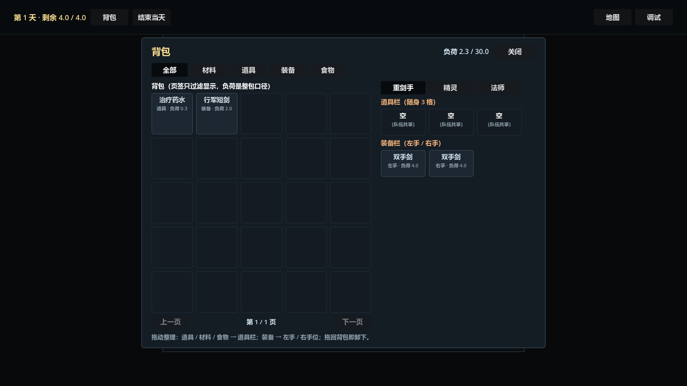
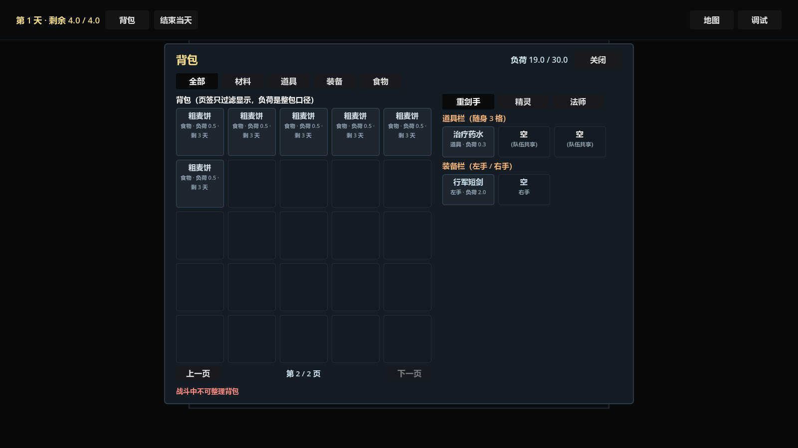

# 背包 UI 美术资源（Scenario 生成，2026-10-02）

> 用户指令（2026-10-02）：「尝试调用 Scenario 生成对应的美术风格资源，参考项目中的美术风格说明文档」。
> 本文件记录这一批**美术资源的出处、风格依据、生成参数与接入状态**，作为后续补图 / 重生成的唯一入口。
> 同类参考：[像素角色动效资源规范](../角色/像素角色动效资源规范.md)（角色侧资源口径）、[伊瑟拉精灵美术资源设计](../角色/伊瑟拉精灵美术资源设计.md)（生成验收写法的先例）、[PSD 素材生成注意事项](../../AIWorkSpace/AgentOps/美术/PSD素材生成注意事项.md)（AI 辅助生产管道）。

## 一、风格依据

| 来源 | 取到的约束 |
|---|---|
| [伊瑟拉精灵美术资源设计](../角色/伊瑟拉精灵美术资源设计.md) | 配色词表：**低饱和鼠尾草绿 + 象牙白 + 旧金装饰 + 深木**；「不加入技能光效和环境背景」 |
| [像素角色动效资源规范](../角色/像素角色动效资源规范.md) | 局内资源尺寸口径（逻辑 48×64）；道具用**独立装备贴图**而非画进角色 |
| `Scripts/Run/BagUi.cs`（界面实现） | 深色面板 `#141c24` / 边线 `#2b3a45` / 标题金 `#f5d98c` / 章节橙 `#f0b27a` / 正文蓝灰 `#cfe3ef` |
| `Resources/Images/UI/IntentIcons/` | 项目**已有的 UI 图标口径**：亮面半写实的单个物件 + 纯白底（`intent_attack.png` 1024×1024→现 1254×1254） |

因此本批图标 = **亮面半写实的单个物件 + 纯白底**（与 `IntentIcons` 同口径），配色落在「旧金 / 鼠尾草绿 / 深木」上；
另出一套**去背版**（真透明 PNG），供深色格底直接叠放。

## 二、文件清单（`Resources/Images/UI/Bag/`）

| 文件 | 尺寸 | 通道 | 用途 |
|---|---|---|---|
| `bag_icon_material.png` | 1024×1024 | RGB（白底） | 材料页签 / 材料格 |
| `bag_icon_item.png` | 1024×1024 | RGB（白底） | 道具页签 / 道具格 |
| `bag_icon_equipment.png` | 1024×1024 | RGB（白底） | 装备页签 / 装备格 |
| `bag_icon_food.png` | 1024×1024 | RGB（白底） | 食物页签 / 食物格 |
| `bag_icon_material_alpha.png` | 1024×1024 | **RGBA（透明）** | 深色格底上直接叠放（推荐） |
| `bag_icon_item_alpha.png` | 1024×1024 | **RGBA（透明）** | 同上 |
| `bag_icon_equipment_alpha.png` | 1024×1024 | **RGBA（透明）** | 同上 |
| `bag_icon_food_alpha.png` | 1024×1024 | **RGBA（透明）** | 同上 |

- 命名规则：`bag_icon_<类别>`（`material` / `item` / `equipment` / `food`），`_alpha` 后缀 = **去背版**。
- 两张同名的图内容一致（同一 asset 的两种导出），**不是两套美术**；改图时两套一起换。
- 每张图都已生成 Godot `.import` 边车（`--headless --import`），可直接 `GD.Load<Texture2D>("res://Resources/Images/UI/Bag/bag_icon_xxx.png")`。

## 三、生成参数（可复现）

### 3.1 出图

| 项 | 值 |
|---|---|
| 模型 | `model_bfl-flux-1-schnell`（FLUX.1 Schnell，Free 计划可用；`recommend` 里的像素专用模型 `model_retrodiffusion-plus` 需 Pro，未用） |
| 尺寸 / 步数 / 输出数 | `1024×1024` / `numInferenceSteps=6` / `numOutputs=1`（一次一张，便于按类别命名） |
| 成本 | 2 CU / 张 × 4 = **8 CU** |

| 类别 | seed | 提示词（逐字） | 生成 asset_id |
|---|---:|---|---|
| 材料 | 20261002 | `mobile game inventory icon: a bundle of dried sage-green herbs tied with twine next to two small grey-blue ore chunks. Glossy stylized game art, warm old-gold rim light, thick clean silhouette, centered single object, soft contact shadow, flat pure white background, no text, no frame, no border` | `asset_a3krvEegV9zG2Z7JVzgevHB6` |
| 道具 | 20261003 | `mobile game inventory icon: a round glass potion flask filled with teal-green liquid, dark cork stopper, small amber sparks around it.` +（同一段风格后缀） | `asset_G1DSM92yHTm6Cw9S3VPMBckf` |
| 装备 | 20261004 | `mobile game inventory icon: a short single-handed sword with an old-gold crossguard, dark leather grip and a plain steel blade pointing up.` +（同一段风格后缀） | `asset_vVRrx5mj692DdXzVjhpsKN3D` |
| 食物 | 20261005 | `mobile game inventory icon: a rustic wheat bread loaf with a small clay jar of honey beside it.` +（同一段风格后缀） | `asset_wMwz4LjjZadszQsnu3WWutrV` |

风格后缀（四条共用，逐字）：`Glossy stylized game art, warm old-gold rim light, thick clean silhouette, centered single object, soft contact shadow, flat pure white background, no text, no frame, no border`。

### 3.2 去背

| 项 | 值 |
|---|---|
| 模型 | `model_birefnet-background-removal`（BiRefNet，`img2img`，无参数，只吃 `image`） |
| 成本 | 2 CU / 张 × 4 = **8 CU** |
| 输入 → 输出 | 上表四张 → `asset_X8yhdYPZyynw4yhNiymA6gvA`（材料）/ `asset_jiT5Ngh5KvoHuAVByXztq9dy`（道具）/ `asset_MBJux8qrYkEF8WZZL55pTTMg`（装备）/ `asset_TogjfzpXe7BVDmugz7bGhdHs`（食物） |
| 下载 | `asset_download` 带 `format=png`（保留 alpha 通道） |

- **合计 16 CU**（4 张白底 + 4 张去背）。
- Free 计划限制：**并行自定义任务上限 2**（第 3 个起 429 `PlanLimitReachedError`）→ 批量生成要**两个两个发**，或用 `wait=false` + `jobs_wait` 收尾。

### 3.3 重新生成 / 换风格

1. 改 `prompt`（保持「物件 + 风格后缀」两段结构）或换 seed，重跑 `model_bfl-flux-1-schnell`；
2. 对结果跑一次 `model_birefnet-background-removal`；
3. `asset_download` 覆盖本节两个 `bag_icon_*` 文件；
4. 跑一次 `--headless --import` 刷新 `.import`，并**回写本表**（seed / asset_id / 提示词）。

## 四、接入状态（**未接线**）

- 当前 `BagUi`（`Scripts/Run/BagUi.cs`）的格区是**程序化绘制**（`StyleBoxFlat` 底 + 文字：名字 `×数量` / 类别 · 负荷 / 食物剩余天数），**没有加载本批图标**。
- 建议接入方式（未实施，留待拍板）：
  1. `BagCell` 增加一个 `TextureRect`（放进现有 `VBoxContainer` 左侧的 `HBoxContainer`），`SetIcon(Texture2D)` 设置；
  2. `BagUi` 侧按 `RunBagEntrySave.CategoryEnum` → `res://Resources/Images/UI/Bag/bag_icon_{category}_alpha.png` 懒加载并缓存（**缺失时回退为无图标**，不能崩、不能阻塞开界面）；
  3. 页签行同理（`BagTab_*` 按钮加 `icon`），装备栏 / 道具栏格按「是装备 / 是道具」用同两张图。
- 未接线的原因：这批图是**第一次按项目风格试生成**，粒面（去背后留半透明描边）与最终尺寸（物品格是 96 × 96 的正方形，图标建议落在 48–56 px）都要先看过效果再定；接进去同时会改掉当前格内排版。

## 五、待办

| # | 项 | 说明 |
|---|---|---|
| 1 | 图标接入背包格 / 页签 | 见 §四；需先确认用 `_alpha` 版还是白底版（白底版在深色格上会亮成白块，推荐 `_alpha`） |
| 2 | 部位装备图标 | 装备界面（P0-18 UI 半）落地时按同一口径补 `bag_icon_head` / `body` / `feet` / `accessory` |
| 3 | 单件物品图标 | 当前只有**按类别**的 4 张；具体物品（如「行军短剑」「粗麦饼」）是否要各出一张，等物品表稳定后成批生成 |
| 4 | 去背描边清理 | 去背版边缘有 1–2 px 半透明残留，缩到 48–56 px（物品格 96 × 96 的正方形）时会出现灰边；接入前用 `Pixelate` / 手工修一次 |

## 六、效果示意图（界面现状）

`Scripts/Run/BagUi.cs` 目前**没有**用 §二的图标，格区是程序化绘制：5 列 × 5 行共 25 个 **96 × 96 正方形**格（空格只留暗底、不写「空」），网格下方是「上一页 / 第 x / y 页 / 下一页」。





- 出图方式：**图形版** Godot 跑 `--run-flow-ui-smoke`（`Tests/` 下的 PNG 产物被 `.gitignore` 忽略，故留一份到这里入库）——
  ```powershell
  $exe = 'D:\MY\Godot\Godot_v4.6.2-stable_mono_win64\Godot_v4.6.2-stable_mono_win64_console.exe'
  Start-Process -FilePath $exe -PassThru -ArgumentList @(
    '--path','"D:\MY\My Game\卡牌模拟器"',
    '--scene','res://Scenes/Run/RunFlowScene.tscn','--position','3000,3000','--','--run-flow-ui-smoke')
  # 产物：Tests/run-flow-ui-smoke-bag.png（第 1 页）、Tests/run-flow-ui-smoke-bag-page2.png（第 2 页）
  ```
- **第 1 页图**：可整理态（无横幅），背包里有 2 件（治疗药水 / 行军短剑），装备栏左右手都占着「双手剑」，空格只剩暗底、不写「空」。
- **第 2 页图**：烟测的**分页夹具**中途抓拍（30 件食物 ⇒ 第 2 页 6 格），底部提示行是上一次落点被拒的原因（红字），`下一页` 已禁用显示为暗色。
- **界面改版后要手工刷新这两张图**（它们不是自动同步的产物）。
- 图标接线后的目标效果 = 本图 + 每格左上角一枚 `bag_icon_*_alpha.png`（见 §四）。
